# LuaJIT Engine — Complete Architecture Map

> An exhaustive map of the LuaJIT tracing JIT pipeline. Not a line-by-line C
> translation — a conceptual model for reimplementation in Moonlift.

---

## 1. Pipeline Overview

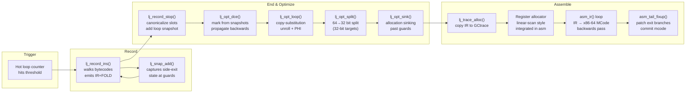

**State machine** (from `lj_trace.c`):

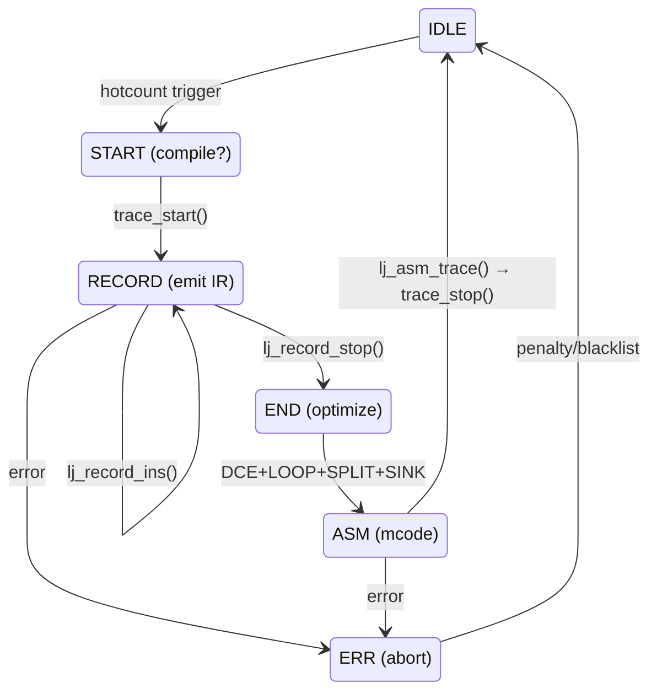

---

## 2. IR: SSA Intermediate Representation

### 2.1 IRIns — Packed 64-bit Instruction

```
byte:  1     2     3     4     5     6     7     8
     +-----+-----+-----+-----+-----+-----+-----+-----+
     |  op1:u16   |  op2:u16   | t:u8 | o:u8 | r:u8 | s:u8 |
     +-----+-----+-----+-----+-----+-----+-----+-----+
                          \_____  o  +  t  =  ot:u16 _____/
                          \ prev:u16 (overlaps r+s) /

               32-bit constants use: i:i32 or gcr:GCRef
               64-bit constants use TWO slots (ir+1)
```

| Field | Size | Purpose |
|---|---|---|
| `o` | `u8` | Opcode (`IROp` enum: IR_ADD, IR_SLOAD, …) |
| `t` | `u8` | Result type + flags (`IRType` enum + IRT_GUARD/IRT_MARK/IRT_ISPHI) |
| `ot` | `u16` | Overlaps t+o for atomic access |
| `op1` | `u16` | Left operand ref (or literal) |
| `op2` | `u16` | Right operand ref (or literal) |
| `r` | `u8` | Allocated register (during asm) |
| `s` | `u8` | Spill slot (during asm) |
| `prev` | `u16` | Previous instruction in CSE chain (overlaps r+s) |

### 2.2 REF_BIAS — The Core Index Trick

```
  0  ...  nk            REF_BIAS (0x8000)           nins        irtoplim
  |-------|-------------------|------------------------|------------|
  ^       ^                   ^                        ^            ^
  |       |                   |                        |            |
  |   constants              BASE                     end          buffer
  |   grow DOWN              grow UP                  of IR        limit
  v                          v
REF_NIL  REF_TRUE  REF_FALSE

Constants < REF_BIAS, instructions ≥ REF_BIAS.
irref_isk(ref) = ref < REF_BIAS  (one comparison!)
```

| Fixed Ref | Value | Meaning |
|---|---|---|
| `REF_NIL` | `0x7FFF` | Nil constant |
| `REF_FALSE` | `0x7FFE` | False constant |
| `REF_TRUE` | `0x7FFD` | True constant |
| `REF_BASE` | `0x8000` | Frame base |
| `REF_FIRST` | `0x8001` | First instruction |
| `REF_DROP` | `0xFFFF` | Sentinel |

### 2.3 TRef — Tagged Reference

```
TRef = (IRType << 24) | ref      (32-bit)

 +---------+---------+-------------------+
 |  irt:u8  | flags:u8|      ref:u16     |
 +---------+---------+-------------------+
```

- **Type check**: `tref_isint(tr)` = `(tr >> 24) == IRT_INT` (single compare)
- **Type range**: `tref_isinteger(tr)` = `(tr >> 24) ∈ [IRT_I8, IRT_INT]`
- **Flags**: `TREF_FRAME`, `TREF_CONT`, `TREF_KEYINDEX` occupy bits 16-23

### 2.4 IR Type System

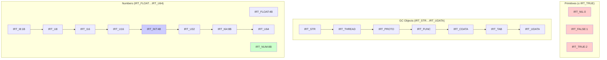

| Mask | Bit | Meaning |
|---|---|---|
| `IRT_TYPE` | `0x1F` | Type only (strip flags) |
| `IRT_MARK` | `0x20` | DCE reachability mark |
| `IRT_ISPHI` | `0x40` | PHI operand marker |
| `IRT_GUARD` | `0x80` | Guard instruction |

### 2.5 Operand Modes

Every IR opcode has its operands classified by `lj_ir_mode[op]`:

| Mode | Value | Meaning |
|---|---|---|
| `IRMref` | 0 | IR reference (≥ REF_BIAS) |
| `IRMlit` | 1 | 16-bit unsigned literal (< REF_BIAS) |
| `IRMcst` | 2 | Constant (only in const area, may span 2 slots) |
| `IRMnone` | 3 | Unused |

| Kind | Value | Instruction class |
|---|---|---|
| `IRM_N` | 0 | Normal |
| `IRM_A` | `0x20` | Allocation |
| `IRM_L` | `0x40` | Load |
| `IRM_S` | `0x60` | Store |

| Flag | Value | Meaning |
|---|---|---|
| `IRM_C` | `0x10` | Commutative |
| `IRM_W` | `0x80` | Non-weak guard |

Example: `IR_ADD` = `(IRMref|IRM_C) | (IRMref<<2) | IRM_N` = commutative normal with two refs.

### 2.6 Opcode Categories

| Category | Opcodes |
|---|---|
| **Guards** | LT, GE, LE, GT, ULT, UGE, ULE, UGT, EQ, NE, ABC, RETF |
| **Meta** | NOP, BASE, PVAL, GCSTEP, HIOP, LOOP, USE, PHI, RENAME, PROF |
| **Constants** | KPRI, KINT, KGC, KPTR, KKPTR, KNULL, KNUM, KINT64, KSLOT |
| **Bit** | BNOT, BSWAP, BAND, BOR, BXOR, BSHL, BSHR, BSAR, BROL, BROR |
| **Arith** | ADD, SUB, MUL, DIV, MOD, POW, NEG, ABS, LDEXP, MIN, MAX, FPMATH |
| **Overflow** | ADDOV, SUBOV, MULOV |
| **Memory ref** | AREF, HREFK, HREF, NEWREF, UREFO, UREFC, FREF, TMPREF, STRREF, LREF |
| **Load** | ALOAD, HLOAD, ULOAD, FLOAD, XLOAD, SLOAD, VLOAD, ALEN |
| **Store** | ASTORE, HSTORE, USTORE, FSTORE, XSTORE |
| **Alloc** | SNEW, XSNEW, TNEW, TDUP, CNEW, CNEWI |
| **Buffer** | BUFHDR, BUFPUT, BUFSTR |
| **Barrier** | TBAR, OBAR, XBAR |
| **Convert** | CONV, TOBIT, TOSTR, STRTO |
| **Call** | CALLN, CALLA, CALLL, CALLS, CALLXS, CARG |

---

## 3. GCtrace — The Compiled Trace

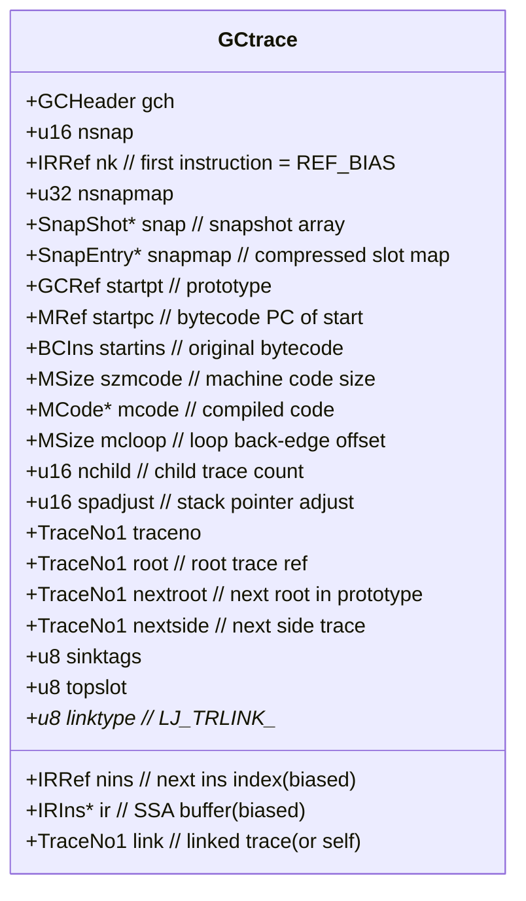

### Link Types

| Link | Value | Meaning |
|---|---|---|
| `LJ_TRLINK_NONE` | 0 | Incomplete |
| `LJ_TRLINK_ROOT` | 1 | Jumps to another root trace |
| `LJ_TRLINK_LOOP` | 2 | Loop back to self |
| `LJ_TRLINK_TAILREC` | 3 | Tail recursion |
| `LJ_TRLINK_UPREC` | 4 | Up-recursion |
| `LJ_TRLINK_DOWNREC` | 5 | Down-recursion |
| `LJ_TRLINK_INTERP` | 6 | Fallback to interpreter |
| `LJ_TRLINK_RETURN` | 7 | Return from trace |
| `LJ_TRLINK_STITCH` | 8 | Stitched trace |

### Trace Tree

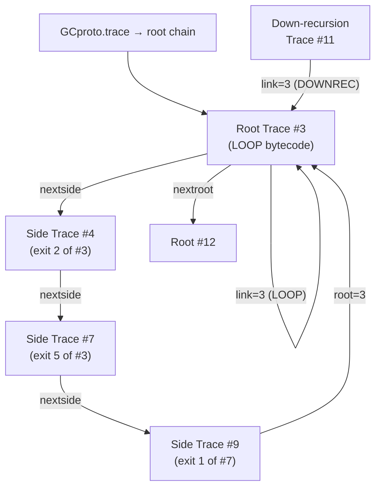

---

## 4. Snapshots — Guard State Preservation

### 4.1 SnapShot

```c
typedef struct SnapShot {
    uint32_t mapofs;    // offset into snapmap[]
    IRRef1   ref;       // first IR ref for this snapshot
    uint16_t mcofs;     // MCode offset (in MCode units)
    uint8_t  nslots;    // number of valid slots
    uint8_t  topslot;   // maximum frame extent
    uint8_t  nent;      // number of compressed entries
    uint8_t  count;     // taken exit count (→ SNAPCOUNT_DONE=255)
} SnapShot;
```

### 4.2 SnapEntry — Compressed Slot Map

```
SnapEntry = (slot:u8 << 24) | flags | ref:u16

Flags:
  SNAP_FRAME      0x010000  — this slot is a frame link
  SNAP_CONT       0x020000  — continuation slot
  SNAP_NORESTORE  0x040000  — don't restore (readonly)
  SNAP_SOFTFPNUM  0x080000  — soft-float number
  SNAP_KEYINDEX   0x100000  — traversal key index
```

Each snapshot stores: `[slot entries ...] [PC pointer (8 bytes)] [frame links]`

### 4.3 Snapshot Lifecycle

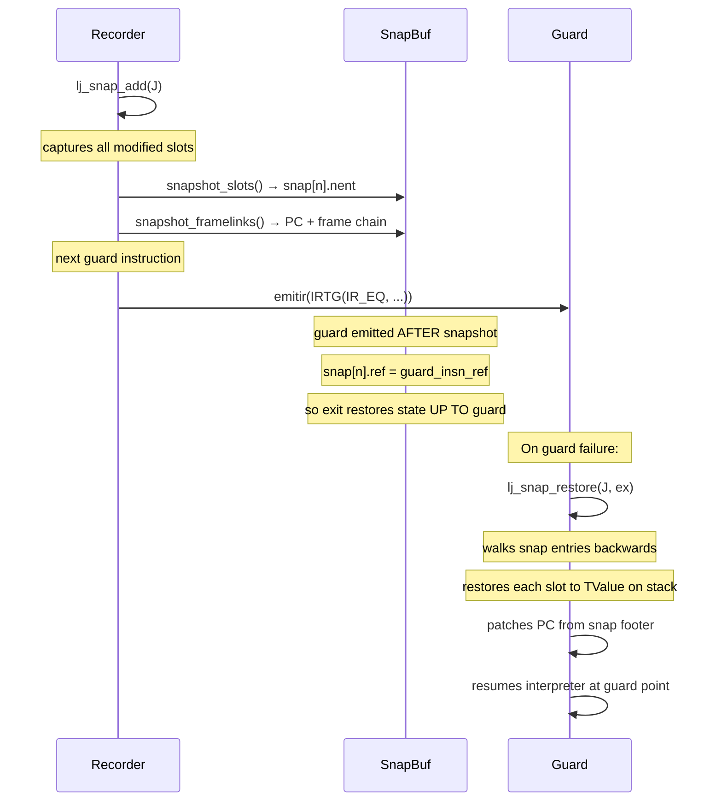

---

## 5. The Recorder — jit_State + Record Loop

### 5.1 jit_State

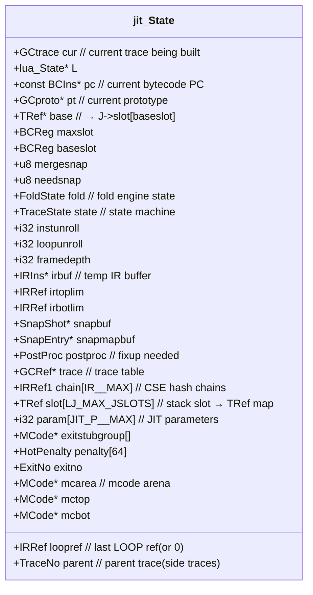

### 5.2 Recording Loop

```
rec_ins(J):
    switch bc_op(*J->pc):
        BC_ADD:
            lhs = getslot(J, b)   // lazy SLOAD + type specialize
            rhs = getslot(J, c)
            emitir(IRT(IR_ADD, INT), lhs, rhs)
            J->base[a] = ref

        BC_MOV:
            J->base[a] = getslot(J, b)

        BC_LOOP:
            lj_record_stop(J, LJ_TRLINK_LOOP, traceno)
            → ends recording, triggers optimization

        BC_FORL / BC_ITERL / BC_ITERN:
            special loop handling with LoopEvent enum
```

### 5.3 FOLD During Recording

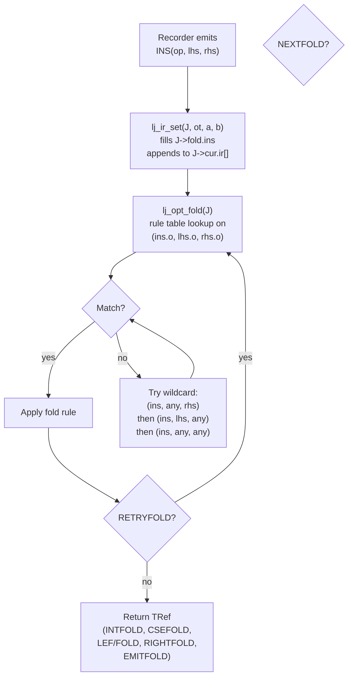

### 5.4 Stack Slot Map

```
J->slot[s] maps Lua stack slot s → TRef
J->base[s] = &J->slot[J->baseslot + s]  (frame-relative)

On first use: getslot(J, s) → sload(J, s)
    1. read actual TValue from J->L->base[s]
    2. determine itype2irt() → IRType
    3. emitir_raw(IRTG(IR_SLOAD, t), s, IRSLOAD_TYPECHECK)
    4. J->base[s] = ref
    5. return TRef(IRT_GUARD|t, ref)

Subsequent uses return cached J->base[s]
```

### 5.5 CSE Chain

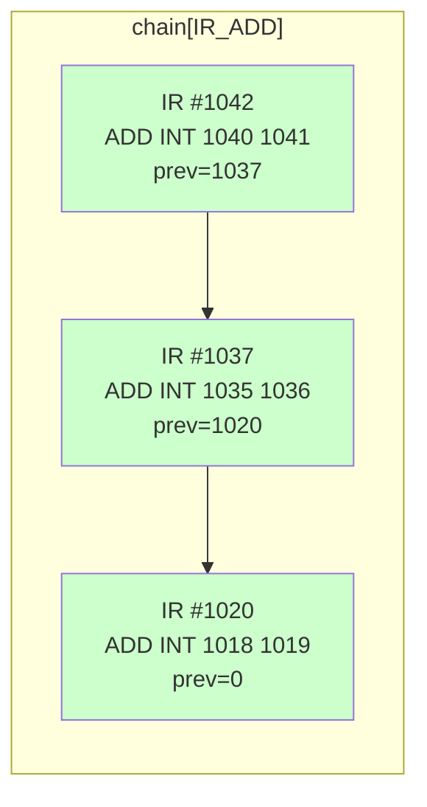

CSE checks: same opcode + same operands → return existing ref. The chain is walked via `prev` field. The FOLD engine automatically chains instructions as they're emitted.

---

## 6. Optimizer Passes

### 6.1 DCE (`lj_opt_dce.c`)

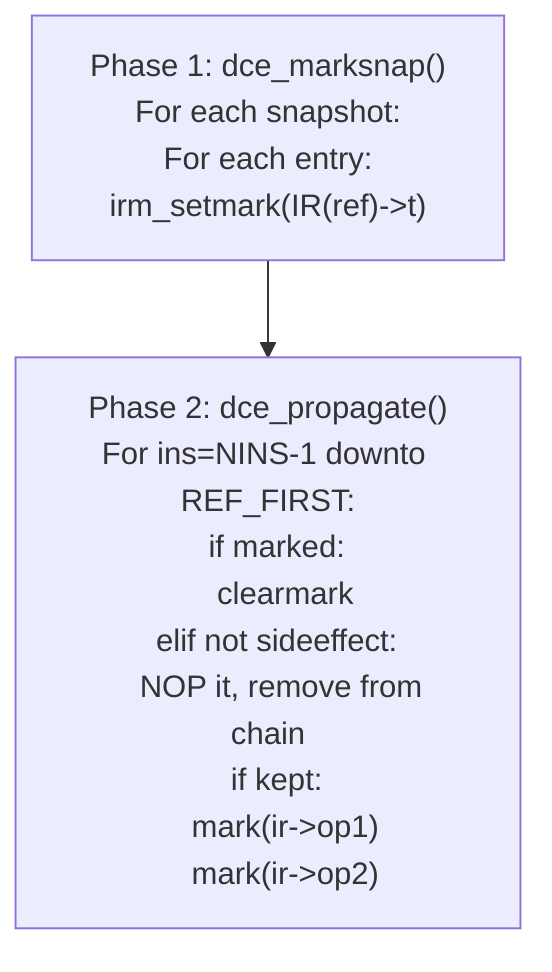

Two phases, <80 lines total. Simplicity from: `irref_isk(op) → false` means `op ≥ REF_BIAS → mark it`.

### 6.2 LOOP (`lj_opt_loop.c`)

Copy-substitution unrolling:

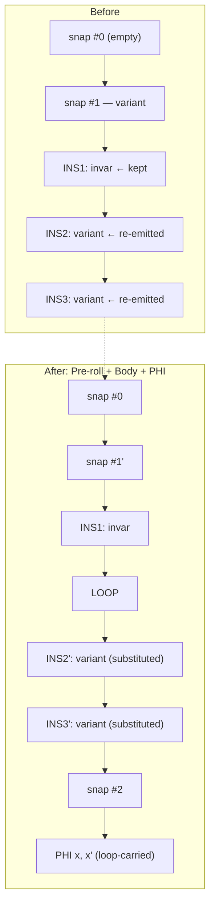

**Substitution table** `subst[old_ref] = new_ref` — maps every instruction from the pre-roll to its re-emitted counterpart. Loop-carried values get PHI nodes. Invariant values keep their original refs.

### 6.3 SINK (`lj_opt_sink.c`)

Allocation sinking: move `TNEW`, `TDUP`, `CNEW` past guards.

### 6.4 Narrowing (`lj_opt_narrow.c`)

Narrow `CONV int→num→int` or `ALOAD→AREF` sequences.

### 6.5 Split (`lj_opt_split.c`)

Split 64-bit IR ops into HI/LO pairs for 32-bit targets. Uses `IR_HIOP`.

---

## 7. Machine Code Emission

### 7.1 ASMState

```c
typedef struct ASMState {
    RegCost cost[RID_MAX];      // register allocation costs
    MCode *mcp;                 // current write position (grows DOWN)
    MCode *mclim;               // lower limit + red zone
    IRIns *ir;                  // copied IR buffer
    jit_State *J;
    RegSet freeset;             // free registers bitmap
    RegSet modset;              // modified-in-loop registers
    RegSet weakset;             // weakly referenced registers
    RegSet phiset;              // PHI registers
    int32_t evenspill;          // next even spill slot
    int32_t oddspill;
    IRRef curins;               // current instruction being assembled
    IRRef stopins;              // stop before here
    SnapNo snapno;              // current snapshot number
    IRRef fuseref;              // fusion limit
    IRRef sectref;              // section base
    IRRef loopref;
    GCtrace *T;                 // the trace being compiled
    IRRef1 phireg[RID_MAX];     // PHI → register map
    // ... x86-specific fields
} ASMState;
```

### 7.2 ASM Pass — Backward Processing

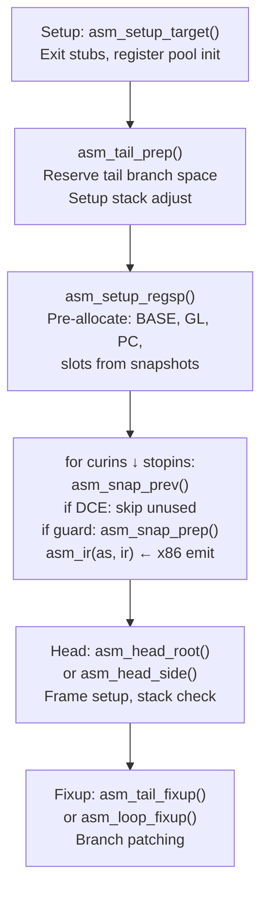

**Why backwards?** MCode grows DOWN from `mctop` toward `mcbot`. `*--mcp = opcode_byte`. Backwards pass means the head (entry) is at the lowest address. Register allocation can look "forward" into already-emitted code for usage info.

### 7.3 asm_ir Dispatch

```
asm_ir(as, ir):
    switch (ir->o):
        IR_SLOAD:     emit MOV from [BASE+offset]
        IR_ADD:       ra_left, ra_right, emit ADD
        IR_SUB:       ra_left, ra_right, emit SUB
        IR_MUL:       ra_left, ra_right, emit IMUL
        IR_EQ/NE:     ra_left, ra_right, emit CMP + guardcc
        IR_LT/GT:     ra_left, ra_right, emit CMP + guardcc
        IR_LOOP:      no-op (loop marker)
        IR_RETF:      asm_retf()
        IR_CALLN:     asm_gencall() → C ABI call
        ...
```

### 7.4 Register Allocation

Integrated into asm_ir. No separate pass.

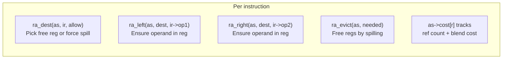

| Operation | What |
|---|---|
| `ra_alloc1(as, ref, allow)` | Ensure ref is in a register |
| `ra_dest(as, ir, allow)` | Pick dest register for ir |
| `ra_left(as, r, ref)` | Load left operand into register |
| `ra_evict(as)` | Free registers by spilling |
| `ra_spill(as, ir)` | Assign spill slot |
| `ra_restore(as, ref, allow)` | Reload spilled value |
| `ra_rematk(as, ref)` | Rematerialize constant |

### 7.5 Trace Entry/Exit

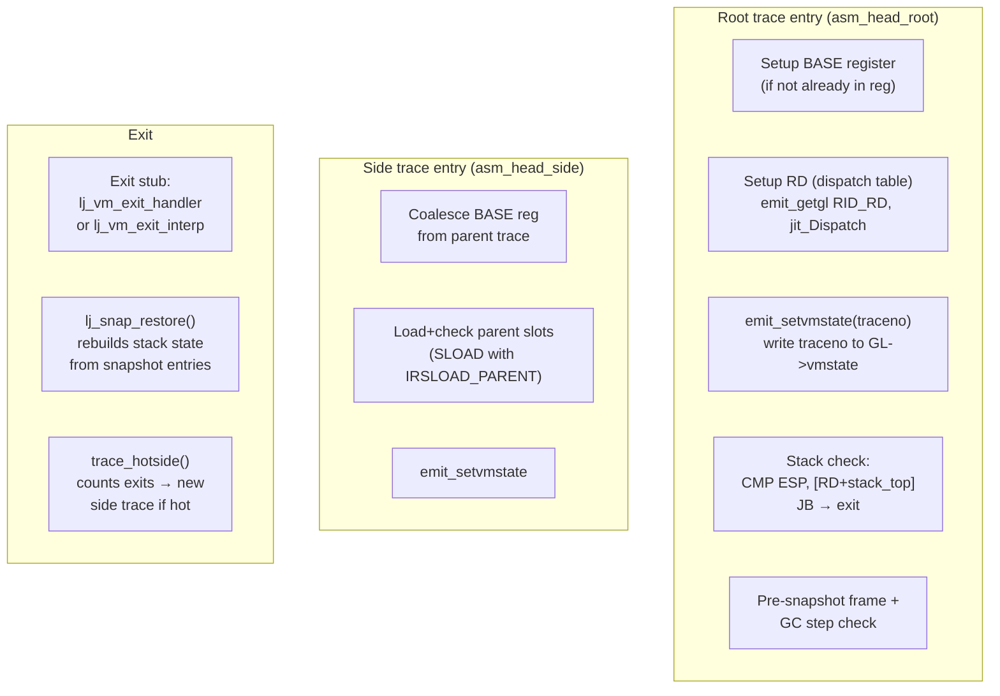

---

## 8. Trace Lifecycle

### 8.1 trace_start()

```
1. Allocate trace number (grow trace[] if needed)
2. memset(&J->cur, 0, sizeof(GCtrace))
3. J->cur.traceno = traceno
4. J->cur.nins = J->cur.nk = REF_BASE
5. J->cur.ir = J->irbuf        // points at temp buffer
6. J->cur.snap = J->snapbuf
7. J->cur.snapmap = J->snapmapbuf
8. setgcref(J->cur.startpt, obj2gco(J->pt))
9. lj_record_setup(J)           // emit BASE, set up slot[] frame links
```

### 8.2 trace_save() — Commit to GCtrace

```
1. Allocate GCtrace = sizeof(GCtrace) + IR + snaps + snapmap
2. memcpy(J->cur → T)
3. T->ir = p - J->cur.nk        // rebase IR pointer
4. T->gct = ~LJ_TTRACE
5. setgcrefp(J->trace[traceno], T)
6. Link into prototype: pt->trace = traceno
```

### 8.3 trace_stop() — Patch Bytecode

```
1. Patch starting bytecode:
     BC_LOOP → BC_JLOOP (with trace# in D field)
     BC_FORL → BC_JFORL
     BC_FUNCF → BC_JFUNCF

2. For side traces:
     Patch parent exit branch to J->cur.mcode
     Mark parent snapshot count = SNAPCOUNT_DONE

3. lj_mcode_commit(J, J->cur.mcode)
4. trace_save(J, T)
```

### 8.4 Exit & Side Trace Flow

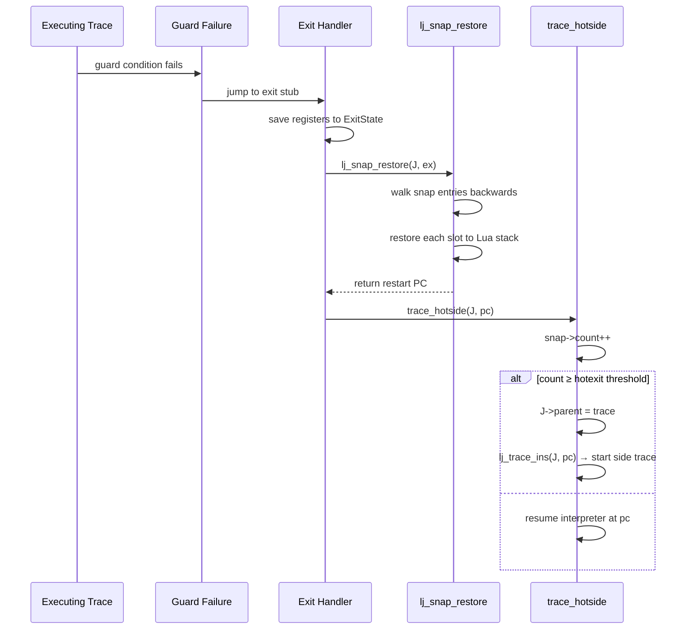

---

## 9. Bytecode Patching

LuaJIT patches the interpreted bytecode to redirect hot paths:

| Original | Patched | Meaning |
|---|---|---|
| `BC_LOOP` | `BC_JLOOP` | Tail-call compiled trace |
| `BC_FORL` | `BC_JFORL` | Compiled numeric for-loop |
| `BC_ITERL` | `BC_JITERL` | Compiled generic for-loop |
| `BC_FUNCF` | `BC_JFUNCF` | Compiled function entry |
| `BC_ITERN` | `BC_JLOOP` | Table iteration (special) |

The `D` field of the patched bytecode stores the trace number. The interpreter and exit handler use it to find the right trace.

---

## 10. Hotcount & Penalties

### 10.1 Hotcount Mechanism

```
Every LOOP/FORL/ITERL bytecode has an embedded hotcount byte.
After each iteration: hotcount[pc] = (hotcount[pc] - 1) & 0x7F
When it hits 0: dispatch to lj_trace_hot()

Default: JIT_P_hotloop = 56 → ~56 iterations to trigger
```

### 10.2 Penalty System

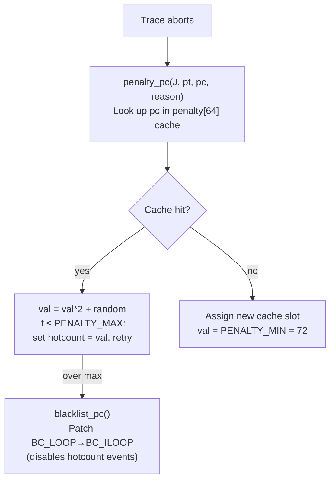

---

## 11. MCode Memory

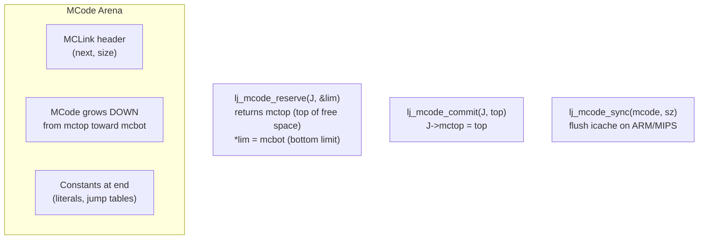

Default: 64KB per area, max 2MB total. Grows by allocating new linked areas.

---

## 12. Key Parameters

| Parameter | Default | Purpose |
|---|---|---|
| `JIT_P_maxtrace` | 1000 | Max traces in cache |
| `JIT_P_maxrecord` | 4000 | Max IR instructions per trace |
| `JIT_P_maxirconst` | 500 | Max IR constants per trace |
| `JIT_P_maxside` | 100 | Max side traces per root |
| `JIT_P_maxsnap` | 500 | Max snapshots per trace |
| `JIT_P_hotloop` | 56 | Iterations to trigger recording |
| `JIT_P_hotexit` | 10 | Exits to trigger side trace |
| `JIT_P_sizemcode` | 64 KB | Per-area mcode size |

---

## 13. What Moonlift Needs

### 13.1 Same: SSA IR Architecture

| Concept | LuaJIT | Moonlift |
|---|---|---|
| IR format | `IRIns{op1,op2,t,o,r,s}` | same packed format |
| REF_BIAS | 0x8000 | same |
| TRef | `(type<<24)\|ref` | same, or struct wrapper |
| Constants | grow down from REF_BIAS | same |
| Chain/CSE | `ir->prev` linked list | same |
| Snapshot | `SnapShot + SnapEntry[]` | same |

### 13.2 Different: Recording

LuaJIT records from Lua bytecodes, specializing types at runtime. Moonlift has full type information from the parser. No type specialization needed — the recorder walks MoonTree nodes (already typed) and emits IR directly.

### 13.3 Same: Optimization Pipeline

DCE, loop unroll (copy-subst), PHI insertion, allocation sinking, narrowing — same algorithms, expressed in Moonlift instead of C macros.

### 13.4 Different: Code Emission

LuaJIT's asm is tightly coupled to Lua TValue layout and the interpreter ABI. Moonlift's backend can be cleaner since we control the calling convention, stack layout, and type representation.

### 13.5 Not Needed

| LuaJIT Feature | Why Not |
|---|---|
| Bytecode interpreter dispatch | Moonlift is AOT + JIT, no interpreter loop |
| Metamethod recording | No Lua metamethods |
| TValue boxing/unboxing | Static types, no runtime tags |
| GC barriers | No Lua GC |
| Blacklisting/penalties | No runtime deoptimization needed |
| Stitching/CALL recording | Moonlift inlines at compile time |

---

## 14. File Map

| File | Role | Lines |
|---|---|---|
| `lj_ir.h` | IR opcodes, types, IRIns, TRef | ~500 |
| `lj_jit.h` | jit_State, GCtrace, SnapShot, params | ~400 |
| `lj_ir.c` | IR buffer grow, emit, kjit helpers | ~500 |
| `lj_record.c` | Bytecode → IR recorder | ~3000 |
| `lj_snap.c` | Snapshot capture + restore | ~1000 |
| `lj_trace.c` | Trace lifecycle, state machine | ~1200 |
| `lj_opt_fold.c` | FOLD + CSE (during recording) | ~2600 |
| `lj_opt_dce.c` | Dead code elimination | ~80 |
| `lj_opt_loop.c` | Copy-subst loop unroll | ~350 |
| `lj_opt_sink.c` | Allocation sinking | ~600 |
| `lj_asm.c` | Register allocator + asm framework | ~2600 |
| `lj_asm_x86.h` | x86-64 code emission | ~3200 |
| `lj_mcode.c` | Machine code memory management | ~300 |
