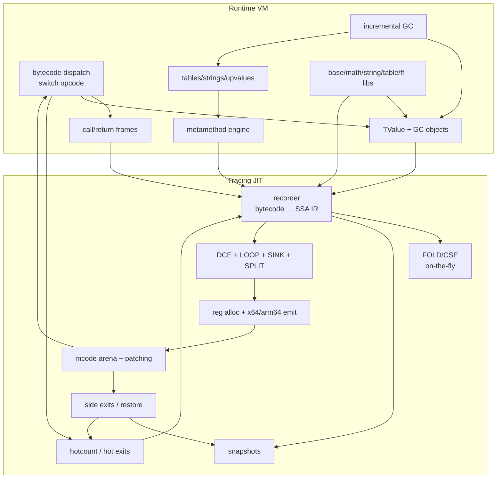
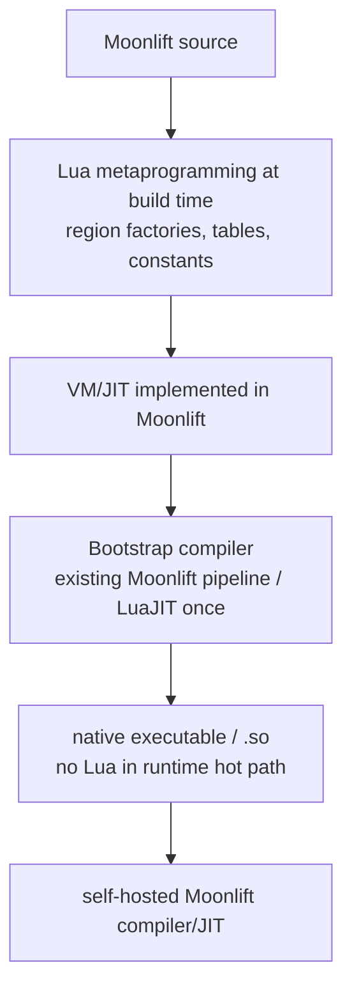
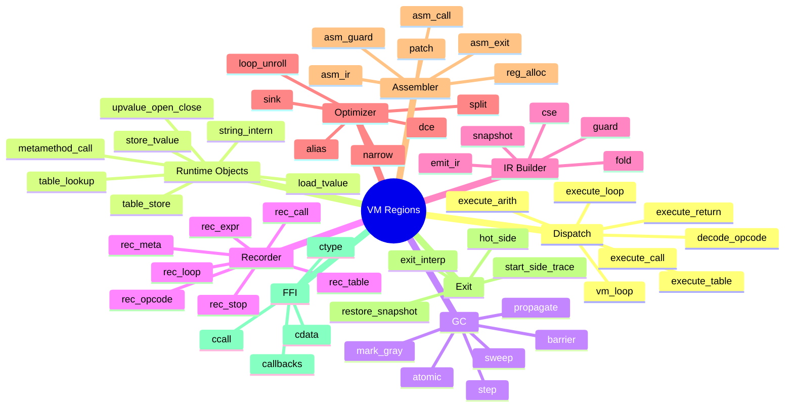
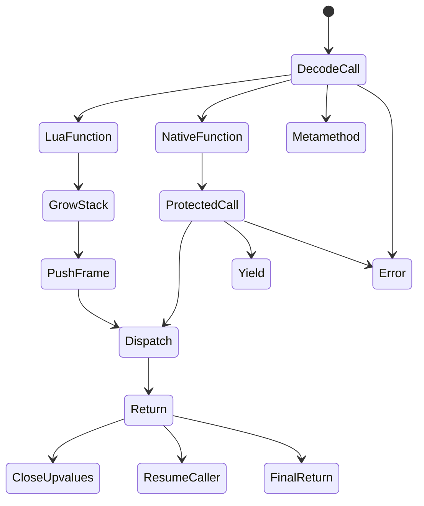
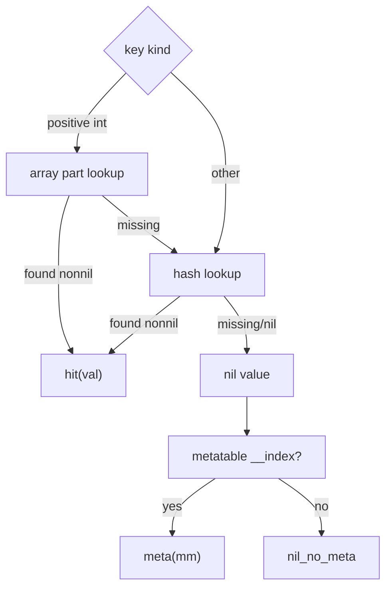
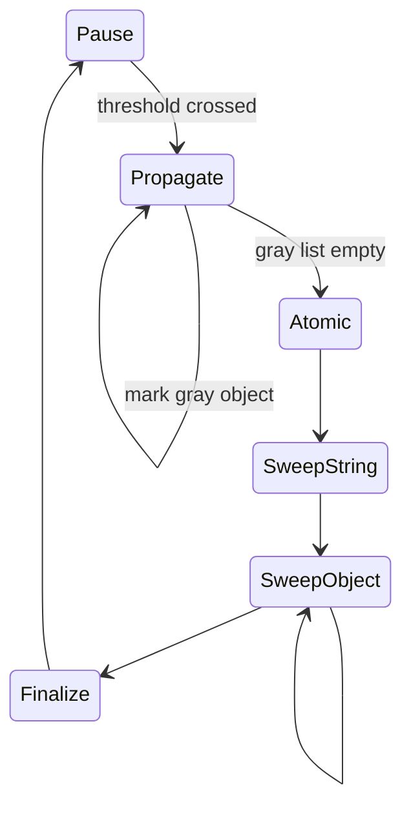
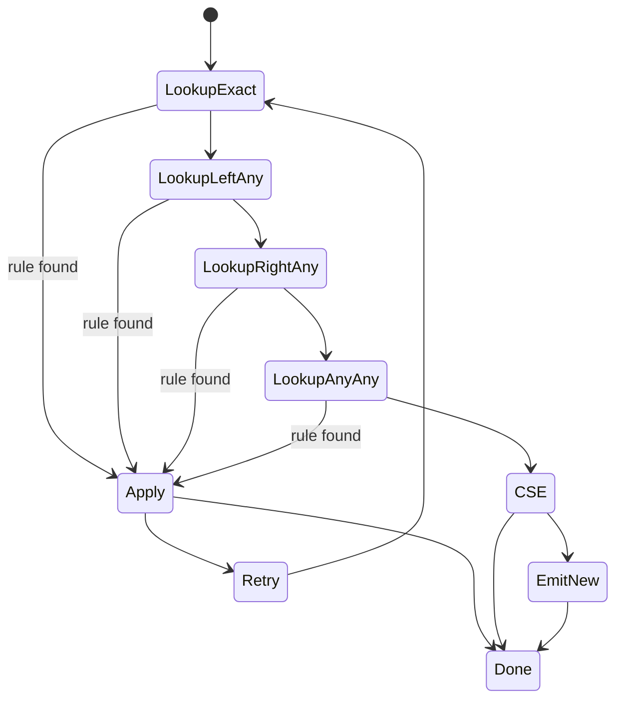
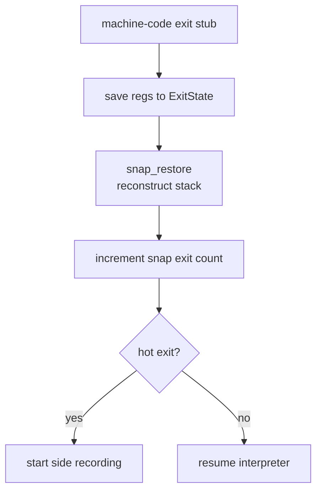

# Full LuaJIT-Grade VM in Moonlift Regions

> Design document for a full LuaJIT-class virtual machine and tracing JIT,
> organized around Moonlift regions as typed control-state fragments.
>
> Goal: not a toy interpreter and not only a first slice. This is the coherent
> whole-system design: runtime object model, bytecode VM, GC, recorder,
> optimizer, snapshots, side exits, trace assembler, FFI/runtime services, and
> bootstrap strategy.

---

## 0. Thesis

A LuaJIT-grade VM is not primarily a collection of functions. It is a family of
interlocking state machines:

- bytecode dispatch
- function call/return
- metamethod lookup
- GC marking/sweeping
- trace recording
- fold/CSE retry
- snapshot capture/restore
- side-exit spawning
- register allocation
- machine-code emission
- mcode patching
- FFI call lowering

In C, these state machines are encoded with switches, flags, return codes,
macros, `longjmp` aborts, and mutable global compiler state.

In Moonlift, each state machine is a **region graph**:

```text
state      = block or region entry
transition = typed jump
external transition = typed continuation
composition = emit
sealing = func
```

This means the VM can be designed as typed control protocols, not as informal C
conventions.

---

## 1. Whole-System Map



The runtime and JIT are mutually aware:

- the interpreter provides exact state for recording;
- the recorder knows bytecode, object layout, and metamethod semantics;
- snapshots know stack/frame/object representation;
- compiled traces call runtime helpers and must obey GC barriers;
- exits return to interpreter or spawn side traces.

Therefore the design must be coherent before implementation.

---

## 2. Layering Contract



Rules:

1. **Lua is build-time only.** It may generate region fragments, opcode tables,
   fold rules, and assembler tile tables.
2. **Runtime VM is Moonlift-compiled native code.** No `lua_State`, no Lua GC, no
   Lua interpreter on the hot path.
3. **Regions compose VM control.** Functions seal stable callable boundaries;
   hot logic remains region-composed.
4. **Switch dispatch for interpreter opcode dispatch.** No if-chain hot loop.
5. **Machine-code backend is native Moonlift.** It writes x64/arm64 bytes into
   mcode arenas and patches branches.

---

## 3. Top-Level Region Families



Each family has a stable typed continuation protocol. The VM is a graph of these
protocols.

---

## 4. Runtime Type Forest

### 4.1 Values

A full LuaJIT VM needs a Lua-compatible dynamic value representation.

```text
TValue
  tag: type/discriminator bits
  payload: 47/48/64-bit value depending on target
```

Design choices:

| Representation | Pros | Cons | Decision |
|---|---|---|---|
| Tagged struct `{tag,payload}` | simplest in Moonlift | slower, larger stack | use first for compiler correctness |
| NaN boxing | LuaJIT-like, compact | target-specific | final runtime representation |
| GC64 pointer-tagging | fast on x64 | more complex | optional second-stage |

Logical value kinds:

| Kind | Payload |
|---|---|
| nil | none |
| false/true | none or bit |
| int | i32/i64 depending dualnum policy |
| num | f64 |
| lightuserdata | raw pointer |
| string | `ptr(GCstr)` |
| table | `ptr(GCtab)` |
| function | `ptr(GCfunc)` |
| thread | `ptr(GCthread)` |
| userdata | `ptr(GCudata)` |
| cdata | `ptr(GCcdata)` |

### 4.2 GC Object Header

All collectable objects share a header:

```text
GCHeader:
  next: ptr(GCobj)
  marked: u8
  gct: u8
```

Object types:

| Object | Fields |
|---|---|
| `GCstr` | hash, length, bytes |
| `GCtab` | array part, hash part, metamethod flags |
| `GCproto` | bytecode, constants, debug info, trace root |
| `GCfuncL` | proto, upvalues, env |
| `GCfuncC` | C/native callback, upvalues |
| `GCupval` | open/closed slot pointer/value |
| `GCthread` | stack, callinfo, status |
| `GCudata` | payload, metatable, env |
| `GCcdata` | ctype id, payload |

### 4.3 VM State

```text
GlobalState:
  string table
  registry
  main thread
  current white bits
  GC lists: allgc, gray, grayagain, weak, finalizers
  trace table
  mcode arenas
  JIT params
  dispatch table

ThreadState:
  stack: TValue[]
  base: ptr(TValue)
  top: ptr(TValue)
  maxstack: ptr(TValue)
  frame chain encoded in stack
  pc: ptr(BCIns)
  status

JitState:
  current trace
  IR buffer
  snapshot buffer
  slot map
  CSE chains
  fold state
  recorder frame state
  assembler temp state
```

---

## 5. Control Graph Philosophy for the VM

A runtime state field is used only when state must persist across suspension,
external calls, or trace exits. Otherwise state is represented by code position.

| Traditional VM | Moonlift VM |
|---|---|
| `enum VMState { Dispatch, Call, Return }` | `block dispatch`, `block call`, `block ret` |
| return code from recorder | typed continuation from `rec_opcode` |
| `J->needsnap` flag | `need_snapshot` continuation |
| `asm_err` longjmp | `abort(code)` continuation |
| allocator failure returns null | `oom()` continuation |
| fold retry by loop flag | `retry(op,a,b)` continuation |

Canonical region shape:

```moonlift
region fragment(input_data...;
    success: cont(...),
    recoverable_exit: cont(...),
    abort: cont(code: i32))
```

This exposes the state machine protocol.

---

## 6. Interpreter Region Design

### 6.1 Main Dispatch

The interpreter is a sealed function around a region graph:

```moonlift
func vm_resume(L: ptr(ThreadState), status: i32) -> i32
    emit vm_loop(L, status;
        yield = ret_yield,
        returned = ret_returned,
        error = ret_error)
end
```

Core region:

```moonlift
region vm_loop(L: ptr(ThreadState), status: i32;
    yield: cont(code: i32),
    returned: cont(nresults: i32),
    error: cont(code: i32))
entry dispatch()
    bc = *L.pc
    op = bc_op(bc)
    switch op
        case BC_ADD:  emit vm_bc_add(L, bc; next=dispatch, error=error)
        case BC_CALL: emit vm_bc_call(L, bc; next=dispatch, yield=yield, error=error)
        case BC_RET:  emit vm_bc_ret(L, bc; returned=returned, next=dispatch)
        case BC_LOOP: emit vm_bc_loop(L, bc; next=dispatch, enter_trace=enter_trace, error=error)
        ...
    end
block enter_trace(tr: TraceNo)
    emit trace_enter(L, tr; next=dispatch, returned=returned, error=error)
end
```

The hot opcode dispatch is a switch, but each handler is a region fragment.
`emit` flattens the composed CFG.

### 6.2 Opcode Handler Protocols

| Handler family | Region exits |
|---|---|
| arithmetic | `next`, `metamethod`, `error` |
| comparison | `next`, `metamethod`, `error` |
| table get | `hit`, `miss_meta`, `error` |
| table set | `next`, `newslot`, `barrier`, `metamethod`, `error` |
| call | `lua_call`, `native_call`, `tailcall`, `yield`, `error` |
| return | `returned`, `resume_caller`, `close_upvalues` |
| loop | `next`, `hot`, `enter_trace`, `error` |

Example arithmetic handler:

```moonlift
region vm_bc_add(L: ptr(ThreadState), bc: BCIns;
    next: cont(),
    error: cont(code: i32))
entry start()
    a = bc_a(bc); b = bc_b(bc); c = bc_c(bc)
    emit load_number_pair(L, b, c;
        ints = add_int,
        nums = add_num,
        metamethod = add_meta,
        error = error)
block add_int(x: i64, y: i64)
    emit store_int(L, a, x + y; next = advance)
block add_num(x: f64, y: f64)
    emit store_num(L, a, x + y; next = advance)
block add_meta()
    emit call_bin_metamethod(L, MM_add, b, c, a;
        next = advance,
        error = error)
block advance()
    L.pc = L.pc + 1
    jump next()
end
```

### 6.3 Call/Return State Machine



Region protocols:

```moonlift
region prepare_call(L, func_slot, nargs, nresults;
    lua: cont(fn: ptr(GCfuncL), base: ptr(TValue)),
    native: cont(fn: ptr(GCfuncC), base: ptr(TValue)),
    metamethod: cont(),
    error: cont(code: i32))

region enter_lua_call(L, fn, base;
    dispatch: cont(),
    stack_overflow: cont(),
    error: cont(code: i32))

region return_from_lua(L, nresults;
    resume_caller: cont(),
    final_return: cont(nresults: i32),
    close_upvalues: cont(level: ptr(TValue)),
    error: cont(code: i32))
```

---

## 7. Runtime Object Regions

### 7.1 Table Lookup

LuaJIT table lookup has fast paths and slow metamethod paths. Moonlift exposes
this protocol directly.

```moonlift
region table_get(L: ptr(ThreadState), tab: ptr(GCtab), key: TValue;
    hit: cont(val: TValue),
    nil_no_meta: cont(),
    meta: cont(mm: TValue),
    error: cont(code: i32))
```



### 7.2 Table Store

```moonlift
region table_set(L, tab, key, val;
    done: cont(),
    need_barrier: cont(obj: ptr(GCobj), val: TValue),
    new_key: cont(),
    meta: cont(mm: TValue),
    error: cont(code: i32))
```

The barrier is an explicit typed exit. This avoids hidden GC invariants in the
middle of table code.

### 7.3 Metamethod Engine

Metamethod resolution is itself a state machine:

```moonlift
region metamethod_binop(L, mm: MMS, lhs: TValue, rhs: TValue;
    call: cont(fn: TValue, lhs: TValue, rhs: TValue),
    not_found: cont(),
    error: cont(code: i32))
```

The interpreter uses it; the recorder uses an equivalent recording protocol.

---

## 8. GC Region Design

The GC is a persistent state machine, so it has both data state (`gcstate`) and
region states.



### 8.1 GC Step Protocol

```moonlift
region gc_step(G: ptr(GlobalState), budget: i32;
    done: cont(used: i32),
    need_finalize: cont(),
    oom: cont(),
    error: cont(code: i32))
```

### 8.2 Barrier Protocols

```moonlift
region gc_barrier_obj(G, parent: ptr(GCobj), child: TValue;
    done: cont())

region gc_barrier_back(G, tab: ptr(GCtab);
    done: cont())
```

Every store region that can create old→young/black→white references has a
`need_barrier` continuation and must fill it.

### 8.3 Allocation Protocol

```moonlift
region gc_alloc(G, size: usize, gct: u8;
    ok: cont(obj: ptr(GCobj)),
    step: cont(required: usize),
    oom: cont())
```

Allocation never returns nullable pointer. It either succeeds or takes a typed
exit.

---

## 9. Trace Recording Regions

The recorder mirrors the interpreter, but each handler emits IR instead of
executing values. It still consults runtime values for specialization.

### 9.1 Recorder Top-Level

```moonlift
region trace_record_root(J: ptr(JitState), L: ptr(ThreadState), startpc: ptr(BCIns);
    compiled: cont(tr: TraceNo),
    stitch: cont(parent: TraceNo, exitno: i32),
    interpret: cont(),
    abort: cont(code: i32))
entry setup()
    emit rec_setup(J, L, startpc; ready = record_loop, abort = abort)
block record_loop(pc: ptr(BCIns))
    bc = *pc
    op = bc_op(bc)
    switch op
        case BC_ADD: emit rec_add(J, L, bc; next=record_loop, abort=abort)
        case BC_TGET: emit rec_tget(J, L, bc; next=record_loop, abort=abort)
        case BC_CALL: emit rec_call(J, L, bc; next=record_loop, stop=stop_call, abort=abort)
        case BC_LOOP: emit rec_loop(J, L, bc; stop=stop_loop, next=record_loop, abort=abort)
        ...
    end
block stop_loop(link: i32)
    emit trace_finalize(J, link; compiled=compiled, abort=abort)
block stop_call(reason: i32)
    emit trace_finalize(J, LJ_TRLINK_RETURN; compiled=compiled, abort=abort)
end
```

### 9.2 Recorder Handler Protocols

| Interpreter handler | Recorder analogue | Key behavior |
|---|---|---|
| `vm_bc_add` | `rec_add` | SLOAD operands, emit ADD or metamethod call |
| `vm_bc_tget` | `rec_tget` | emit HREF/HLOAD guards, record __index path |
| `vm_bc_tset` | `rec_tset` | emit HSTORE, barriers, guards |
| `vm_bc_call` | `rec_call` | inline Lua call or stop/link |
| `vm_bc_ret` | `rec_ret` | close trace or inline return |
| `vm_bc_loop` | `rec_loop` | end root trace, add LOOP/PHI |
| `vm_bc_forl` | `rec_forl` | specialized numeric for loop |
| `vm_bc_iterl` | `rec_iterl` | specialize iterator/table next |

### 9.3 Slot Map Protocol

```moonlift
region rec_getslot(J: ptr(JitState), slot: BCReg;
    have: cont(ref: TRef),
    need_sload: cont(slot: BCReg),
    abort: cont(code: i32))

region rec_sload(J, slot, runtime_value: TValue;
    ref: cont(tref: TRef),
    unsupported_type: cont(tag: u8),
    abort: cont(code: i32))
```

`need_sload` is not a flag. It is an explicit state edge.

---

## 10. IR Builder and FOLD Regions

### 10.1 IR Representation

Use LuaJIT's proven shape:

```text
IRIns: 64-bit packed
  op1:u16 op2:u16 t:u8 o:u8 r:u8 s:u8

Constants grow downward from REF_BIAS.
Instructions grow upward from REF_BIAS.
TRef = type-tagged IRRef.
```

### 10.2 Emit Protocol

```moonlift
region ir_emit(J: ptr(JitState), ot: IROpType, a: TRef, b: TRef;
    result: cont(ref: TRef),
    retry: cont(ot: IROpType, a: TRef, b: TRef),
    need_snapshot: cont(guard_ref: IRRef),
    overflow: cont(),
    abort: cont(code: i32))
```

But most clients do not call raw `ir_emit`; they call instruction families:

```moonlift
region emit_arith(J, op, ty, a, b;
    result: cont(ref: TRef),
    guard: cont(ref: TRef),
    abort: cont(code: i32))
```

### 10.3 FOLD as Typed State Machine



Region protocol:

```moonlift
region fold_ir(J, ins: IRIns;
    replace: cont(ref: TRef),
    emit: cont(ins: IRIns),
    retry: cont(ins: IRIns),
    snapshot: cont(ins: IRIns),
    abort: cont(code: i32))
```

Fold rule factories generate monomorphic rule regions:

```lua
fold_rule("ADD", "KINT", "KINT", function(a,b)
    return region fold_add_kint_kint(...; replace, retry, emit, abort) ... end
end)
```

No runtime rule polymorphism is required in hot compiler code if the rule table
is generated as a switch/dispatch region.

---

## 11. Snapshot and Deoptimization Regions

### 11.1 Snapshot Capture

```moonlift
region snap_add(J: ptr(JitState), guard_ref: IRRef;
    done: cont(snapno: SnapNo),
    merge_with_previous: cont(snapno: SnapNo),
    overflow: cont(),
    abort: cont(code: i32))
```

Capture is a typed walk over VM slots and frame links:

```moonlift
region snap_capture_slots(J, L;
    entry_written: cont(slot: i32, ref: IRRef),
    done: cont(nent: i32),
    overflow: cont())
```

### 11.2 Snapshot Restore

Runtime exit protocol:

```moonlift
region trace_exit_handler(G: ptr(GlobalState), ex: ptr(ExitState);
    resume_interp: cont(L: ptr(ThreadState), pc: ptr(BCIns)),
    start_side_trace: cont(parent: TraceNo, exitno: ExitNo),
    error: cont(code: i32))
```

Restore protocol:

```moonlift
region snap_restore(L: ptr(ThreadState), T: ptr(Trace), exitno: ExitNo, ex: ptr(ExitState);
    restored: cont(pc: ptr(BCIns)),
    unsupported: cont(code: i32),
    error: cont(code: i32))
```



---

## 12. Optimizer Regions

Optimization passes operate over flat IR arrays. Each pass is expressed as a
region because each pass has meaningful exits: changed/unchanged, overflow,
unsupported, needs retry.

### 12.1 Pipeline Protocol

```moonlift
region optimize_trace(J: ptr(JitState), T: ptr(Trace);
    optimized: cont(T: ptr(Trace)),
    retry_recording: cont(reason: i32),
    abort: cont(code: i32))
entry start()
    emit opt_dce(J,T; done=after_dce, abort=abort)
block after_dce()
    emit opt_loop(J,T; done=after_loop, not_loop=after_loop, abort=abort)
block after_loop()
    emit opt_narrow(J,T; done=after_narrow, abort=abort)
block after_narrow()
    emit opt_sink(J,T; done=after_sink, disabled=after_sink, abort=abort)
block after_sink()
    emit opt_split(J,T; done=optimized, abort=abort)
end
```

### 12.2 DCE

```moonlift
region opt_dce(J, T;
    done: cont(),
    abort: cont(code: i32))
```

States:

1. mark refs from snapshots;
2. walk IR backwards;
3. keep side-effecting instructions;
4. NOP dead instructions;
5. repair CSE chains.

### 12.3 LOOP

```moonlift
region opt_loop(J, T;
    done: cont(),
    not_loop: cont(),
    overflow: cont(),
    abort: cont(code: i32))
```

States:

- identify variant refs;
- build substitution table;
- re-emit loop body under substitution;
- create PHIs;
- rewrite snapshots.

### 12.4 SINK / Allocation Sinking

```moonlift
region opt_sink(J, T;
    done: cont(),
    disabled: cont(),
    abort: cont(code: i32))
```

Allocation states are explicit:

```moonlift
region sink_candidate(T, ref;
    sinkable: cont(ref: IRRef),
    escapes: cont(reason: i32),
    needs_snapshot_materialization: cont(ref: IRRef))
```

---

## 13. Assembler and Register Allocator Regions

The assembler is a backward state machine over IR.

### 13.1 Top-Level Assembler

```moonlift
region asm_trace(J: ptr(JitState), T: ptr(Trace);
    mcode: cont(entry: ptr(MCode), size: usize),
    retry_realign: cont(),
    retry_ir_grew: cont(),
    mcode_full: cont(),
    abort: cont(code: i32))
entry setup()
    emit mcode_reserve(J; ok=tail_prep, full=mcode_full)
block tail_prep(area: ptr(MCodeArea))
    emit asm_tail_prep(A,T; done=setup_regs)
block setup_regs()
    emit asm_setup_regsp(A,T; done=backward_loop)
block backward_loop(ref: IRRef)
    if ref <= A.stopins then jump head() end
    emit asm_one_ir(A, ref;
        done=next_ref,
        need_snapshot=prep_snapshot,
        mcode_full=mcode_full,
        abort=abort)
block next_ref(ref: IRRef)
    jump backward_loop(ref - 1)
block head()
    emit asm_head(A,T; done=fixup, abort=abort)
block fixup()
    emit asm_tail_fixup(A,T; done=mcode, retry_realign=retry_realign, abort=abort)
end
```

### 13.2 Register Allocation Protocol

```moonlift
region ra_alloc(A: ptr(AsmState), ref: IRRef, allow: RegSet;
    reg: cont(r: Reg),
    remat: cont(r: Reg),
    spill_and_retry: cont(victim: IRRef),
    fail: cont(code: i32))

region ra_dest(A, ref, allow;
    reg: cont(r: Reg),
    spill: cont(victim: IRRef),
    fail: cont(code: i32))
```

### 13.3 IR Tile Protocol

Each IR opcode has an assembler tile region:

```moonlift
region asm_ir_add_i64(A: ptr(AsmState), ref: IRRef;
    done: cont(),
    mcode_full: cont(),
    abort: cont(code: i32))
```

Generated dispatch:

```moonlift
region asm_one_ir(A, ref;
    done: cont(), need_snapshot: cont(snapno: SnapNo), mcode_full: cont(), abort: cont(code: i32))
entry start()
    op = IR(ref).op
    switch op
        case IR_ADD: emit asm_ir_add(A, ref; done=done, mcode_full=mcode_full, abort=abort)
        case IR_SLOAD: emit asm_ir_sload(A, ref; done=done, mcode_full=mcode_full, abort=abort)
        case IR_EQ: emit asm_ir_guard_cmp(A, ref; done=done, mcode_full=mcode_full, abort=abort)
        ...
    end
end
```

The assembler remains switch-driven but decomposed into region tiles.

---

## 14. Machine Code and Patch Regions

### 14.1 MCode Allocation

```moonlift
region mcode_reserve(J: ptr(JitState), need: usize;
    ok: cont(area: ptr(MCodeArea), top: ptr(MCode)),
    grow: cont(),
    full: cont())
```

### 14.2 Branch Patching

```moonlift
region patch_trace_link(J, from: TraceNo, to: TraceNo;
    direct: cont(),
    indirect: cont(),
    out_of_range: cont(),
    error: cont(code: i32))
```

### 14.3 Exit Stub Generation

```moonlift
region emit_exit_stub(A, exitno: ExitNo;
    done: cont(addr: ptr(MCode)),
    mcode_full: cont())
```

Exit stubs are backend-specific region factories.

---

## 15. FFI Regions

A full LuaJIT VM includes FFI. The FFI is two systems:

1. compile-time/runtime ctype model;
2. JIT lowering for cdata operations and calls.

### 15.1 CType Forest

```text
CType:
  void, int, float, pointer, array, struct, union, enum, function
CTypeState:
  type table, name table, ABI metadata, layout cache
CData:
  ctype id + inline/external payload
```

### 15.2 CData Operations

```moonlift
region cdata_index(L, cd: ptr(GCcdata), key: TValue;
    field: cont(addr: ptr(u8), ctype: CTypeID),
    method: cont(fn: TValue),
    error: cont(code: i32))

region cdata_store(L, cd, key, val;
    done: cont(),
    barrier: cont(),
    error: cont(code: i32))
```

### 15.3 C Calls

```moonlift
region ffi_prepare_call(L, cfun: ptr(CFunction), args: ptr(TValue), nargs: i32;
    call_direct: cont(cif: ptr(CIF), argv: ptr(u8)),
    need_conversion: cont(argno: i32),
    error: cont(code: i32))

region ffi_emit_call(A: ptr(AsmState), ci: CCallInfo;
    done: cont(),
    spill_regs: cont(),
    unsupported_abi: cont(code: i32),
    mcode_full: cont())
```

---

## 16. Error and Abort Discipline

C LuaJIT uses non-local exits for trace aborts. Moonlift should make abort edges
typed.

### 16.1 Runtime Errors

```moonlift
region runtime_error(L, code: i32;
    protected_handler: cont(frame: ptr(CFrame)),
    unprotected: cont(code: i32))
```

### 16.2 Trace Abort

```moonlift
region trace_abort(J, code: i32;
    retry_later: cont(),
    blacklist: cont(pc: ptr(BCIns)),
    fatal: cont(code: i32))
```

Abort is part of every compiler-region protocol. No hidden longjmp.

---

## 17. Generated Tables and Region Factories

Build-time Lua generates monomorphic Moonlift regions/tables for:

| Generated artifact | Purpose |
|---|---|
| opcode enum/table | interpreter and recorder switch cases |
| IR opcode metadata | operand modes, side effects, type rules |
| fold rule dispatch | on-the-fly optimizer rules |
| VM helper declarations | runtime helper ABI |
| asm tile dispatch | IR opcode → backend tile |
| x64 encoding helpers | instruction byte emission fragments |
| ctype layout helpers | FFI layout specializations |
| metamethod names | interned symbols and dispatch slots |

This replaces LuaJIT's C macro DSLs with region factories and ASDL values.

---

## 18. Control Protocol Summary

| Subsystem | Primary region | Main exits |
|---|---|---|
| interpreter | `vm_loop` | `yield`, `returned`, `error` |
| opcode handler | `vm_bc_*` | `next`, `metamethod`, `error`, `hot` |
| call | `prepare_call` | `lua`, `native`, `metamethod`, `error` |
| table get | `table_get` | `hit`, `nil_no_meta`, `meta`, `error` |
| table set | `table_set` | `done`, `need_barrier`, `new_key`, `meta`, `error` |
| GC step | `gc_step` | `done`, `need_finalize`, `oom`, `error` |
| recorder | `trace_record_root` | `compiled`, `stitch`, `interpret`, `abort` |
| IR emit | `ir_emit` | `result`, `retry`, `need_snapshot`, `overflow`, `abort` |
| fold | `fold_ir` | `replace`, `emit`, `retry`, `snapshot`, `abort` |
| snapshot | `snap_add` | `done`, `merge`, `overflow`, `abort` |
| optimizer | `optimize_trace` | `optimized`, `retry_recording`, `abort` |
| assembler | `asm_trace` | `mcode`, `retry`, `mcode_full`, `abort` |
| exit | `trace_exit_handler` | `resume_interp`, `start_side_trace`, `error` |
| FFI call | `ffi_prepare_call` | `call_direct`, `need_conversion`, `error` |

---

## 19. Implementation Order Without Fragmented Design

The design is whole-system. Implementation can still be staged, but every stage
must respect the final protocols.

1. **Define data layout contracts**: TValue, GC header, bytecode, IRIns, Trace,
   Snapshot, AsmState.
2. **Define region signatures only** for all subsystems above.
3. **Generate opcode/fold/asm metadata** via Lua region factories.
4. **Implement interpreter core** with final handler protocols, even if many
   continuations initially go to `unsupported`.
5. **Implement GC allocation/barriers early** so object layout does not change.
6. **Implement recorder using final IR/TRef/snapshot layout**.
7. **Implement optimizer passes.**
8. **Implement x64 backend and exit stubs.**
9. **Add side traces.**
10. **Fill out metamethods, libraries, FFI.**

The important point: no toy IR, no toy VM state, no fake stack discipline. Early
implementation may leave features unsupported, but the shapes and protocols must
already be final.

---

## 20. Non-Negotiable Invariants

1. Every VM state transition is a block jump or typed continuation.
2. Every region exit is declared in the signature.
3. Runtime nullable pointer returns are forbidden in hot infrastructure; use
   typed `oom/error/miss` continuations.
4. Interpreter dispatch is a switch on bytecode opcode.
5. Recorder and interpreter share opcode metadata but not implementation logic.
6. IR uses stable LuaJIT-like `IRIns`/`TRef`/`REF_BIAS` layout.
7. Snapshots are the only deoptimization contract between machine code and
   interpreter.
8. Every guard has an associated snapshot or an explicit proof it cannot exit.
9. Every store that can violate GC color invariant has a visible barrier edge.
10. MCode emission never silently grows/reallocates under a pointer used by
    emitted code; retries are explicit continuations.
11. No Lua in runtime hot path.
12. Region composition is the primary abstraction; functions seal boundaries.

---

## 21. The Core Mental Model

A full LuaJIT VM in Moonlift is not:

```text
C VM rewritten in another syntax
```

It is:

```text
LuaJIT's implicit control protocols made explicit as typed region graphs.
```

The bytecode VM, the recorder, the optimizer, the GC, and the assembler are all
state machines. Moonlift's unique advantage is that their states and exits can be
declared and type-checked instead of hidden inside mutable flags and return
codes.

This is the reason the full VM is plausible in Moonlift: the hardest part of a
JIT is not arithmetic or byte decoding. It is maintaining dozens of control-flow
invariants across phases. Regions make those invariants part of the language.
